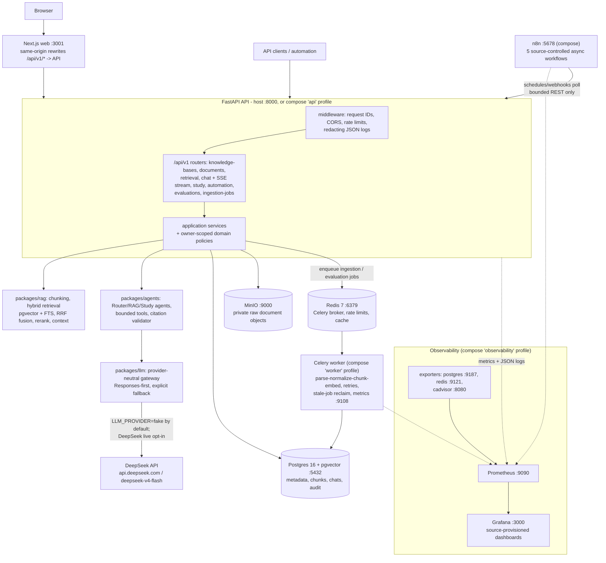

# RAG_LLM_Services

## Overview

`RAG_LLM_Services` is a production-shaped learning platform for private-document RAG, grounded LLM answers, study agents, workflow automation, and observability.

The local default is safe for development and CI: it uses deterministic fakes for LLM calls and evaluation, never requires a real DeepSeek key, and keeps production auth, live-provider proof, deployment cutover, and backup/restore as separate release gates.

## Current Status

Phases 01-16 are implemented locally: repository contract, backend foundation, document storage, ingestion, hybrid retrieval, LLM gateway, study agents, Redis/Celery worker, n8n contracts, Prometheus, Grafana, fixture-safe evaluation, Next.js web app, security hardening, CI/documentation definitions, and release-readiness evidence.

Hosted GitHub Actions are green on the `v0.1.0` pre-release commit `d9162f8` (CI, Security, and Container Build workflows each report success on the pushed commit). The optional live DeepSeek smoke passed on 2026-09-08 with the operator-supplied key (`RUN_DEEPSEEK_LIVE_TESTS=1`, one synthetic prompt, bounded 16-token output); chat and study flows remain mocked by default. The `v0.1.0` api, worker, and web images are published to both the GitHub Container Registry and Docker Hub as one-off release artifacts (see [published release images](#published-release-images)); the container operating model is local Docker Compose builds, and CI intentionally performs no registry publishing (maintainer decision of 2026-09-08). Production deployment, production auth, and production backup/restore execution remain `NOT_RUN` or `HOLD` until those external gates are explicitly executed. Local backup/restore dry-runs and compose release smoke pass. See [the v0.1.0 release](https://github.com/JasonTM17/RAG_LLM_Services/releases/tag/v0.1.0).

## Architecture



Text view:

```text
Browser
  -> Next.js app and rewrites
  -> FastAPI API
  -> application services
  -> Postgres, pgvector, Redis, MinIO
  -> RAG retrieval, agents, and LLM gateway
  -> DeepSeek-compatible provider when live mode is authorized

API and worker metrics
  -> Prometheus
  -> Grafana dashboards

n8n schedules and webhooks
  -> bounded API endpoints
  -> worker jobs, evaluation runs, and automation reports
```

Start with [System overview](docs/architecture/system-overview.md), then use [Repository structure](docs/architecture/repository-structure.md) to find code owners.

## Features

- Owner-scoped knowledge bases and document upload/download/delete APIs.
- Parser, normalization, semantic chunking, embedding, and version-aware indexing pipeline.
- Hybrid vector plus keyword retrieval with optional reranking and source-labeled context.
- Mocked and DeepSeek-compatible chat gateway with semantic streaming and final-event citations.
- Study agent endpoints for quizzes, flashcards, and learning plans with citation validation.
- Redis/Celery worker path for ingestion and evaluation jobs.
- Source-controlled n8n workflows for orchestration outside the synchronous chat path.
- Prometheus metrics, Grafana dashboards, and structured redacting JSON logs.
- Fixture-safe RAG evaluation runner and queued evaluation API.
- Next.js operational frontend for chat, documents, knowledge bases, study tools, and status.
- Security gates for CORS, rate limits, upload abuse, prompt injection, citation abuse, SQL patterns, dependency advisories, and secret-shaped values.

## Technology Stack

- Python `3.13` with `uv` workspaces.
- FastAPI, SQLAlchemy async, Alembic, PostgreSQL, and pgvector.
- Redis and Celery for queue-backed work.
- MinIO for private raw document objects.
- Next.js `16`, React `19`, TypeScript, Vitest, and Playwright-ready E2E tests.
- n8n, Prometheus, Grafana, Postgres exporter, Redis exporter, and optional cAdvisor.
- Node `24.12.0` with `pnpm@11.0.9`.

## Quick Start

Install the pinned toolchain, then run the safe local checks:

```powershell
uv sync
pnpm install --frozen-lockfile
.\scripts\verify-phase-15.ps1
.\scripts\verify-phase-16.ps1
```

For day-to-day development:

```powershell
make api-run
pnpm web:dev
```

The API listens on `http://localhost:8000` by default. The direct Next.js dev server listens on `http://localhost:3000`; the compose web profile uses `WEB_PORT=3001`.

## Environment Configuration

Use `.env.example` as the placeholder-only contract and put local secrets in `.env`. The application reads environment variables only; `.env` loading is handled by the runtime command or Docker Compose, not by in-process settings.

Important defaults:

- `LLM_PROVIDER=fake` for local and CI.
- `RUN_DEEPSEEK_LIVE_TESTS=false` unless live provider proof is explicitly authorized.
- `DEEPSEEK_BASE_URL=https://api.deepseek.com` without a `/v1` suffix.
- `QUEUE_PROVIDER=celery` and `RATE_LIMIT_BACKEND=redis` for Compose and production-shaped runs.
- Production mode rejects placeholder secrets, dev auth, non-DeepSeek provider mode, memory queue/rate limiting, disabled rate limiting, and local or non-HTTPS CORS origins.

## Docker

Validate the topology without starting containers:

```powershell
docker compose --profile api --profile worker --profile web --profile observability --profile container-observability config --quiet
```

Build the three application images:

```powershell
make container-build
```

Run the local compose API, worker, web, and observability surfaces as needed:

```powershell
docker compose --profile api up api
docker compose --profile worker up worker
docker compose --profile web up web
docker compose --profile worker --profile observability up
```

### Published release images

The `v0.1.0` api, worker, and web images are published to both registries, with `:latest` mirroring `:v0.1.0`:

```powershell
# GitHub Container Registry
docker pull ghcr.io/jasontm17/rag-llm-services-api:v0.1.0
docker pull ghcr.io/jasontm17/rag-llm-services-worker:v0.1.0
docker pull ghcr.io/jasontm17/rag-llm-services-web:v0.1.0

# Docker Hub (manifest-identical content)
docker pull nguyenson1710/rag-llm-services-api:v0.1.0
docker pull nguyenson1710/rag-llm-services-worker:v0.1.0
docker pull nguyenson1710/rag-llm-services-web:v0.1.0
```

These images are one-off public release artifacts for `v0.1.0`. Day-to-day operation builds images locally with `make container-build` and the compose profiles above; CI does not publish to image registries by design (maintainer decision of 2026-09-08). Any future remote publication is an explicit manual operator action, and the deleted tag-triggered publish step is on record in commit `eba44ee` if it is ever wanted again.

More deployment notes live in [Docker deployment notes](docs/deployment/docker.md).

## API Usage

Health and metrics:

- `GET /health/live`
- `GET /health/ready`
- `GET /metrics`

Primary API surfaces:

- Knowledge bases and documents under `/api/v1/knowledge-bases` and `/api/v1/documents`.
- Retrieval at `POST /api/v1/retrieval/search`.
- Chat at `POST /api/v1/chat` and `POST /api/v1/chat/stream`.
- Study workflows at `POST /api/v1/study/quiz`, `POST /api/v1/study/flashcards`, and `POST /api/v1/study/learning-plan`.
- Automation reports and evaluations under `/api/v1/automation/reports` and `/api/v1/evaluations`.

## n8n

Workflow exports live under `workflows/n8n/` and are inactive, credential-free source artifacts. Validate them with:

```powershell
make validate-n8n
```

The n8n contract is documented in [n8n workflow contract](docs/n8n/workflows.md).

## Prometheus and Grafana

Prometheus and Grafana are source-configured under `infra/prometheus/` and `infra/grafana/`. Validate them with:

```powershell
make validate-prometheus
make validate-grafana
```

Runtime and dashboard guidance lives in [Metrics and observability](docs/observability/metrics.md).

## Testing

Local verification is split by phase and by surface:

```powershell
make verify-phase-15
make api-lint
make api-typecheck
make api-test
make web-verify
make web-build
make secret-scan
make dependency-scan
make sql-scan
```

GitHub Actions definitions live in `.github/workflows/` and are locally validated by `make validate-workflows`. Hosted CI is not evidence until a pushed workflow run is inspected.

## Evaluation

The evaluation runner uses fixture-safe data under `evals/datasets/` and writes safe aggregate reports under the configured `EVAL_REPORTS_DIR`.

```powershell
make eval
```

Retrieval and evaluation details are in [Hybrid retrieval and reranking pipeline](docs/rag/retrieval-pipeline.md).

## Security

The local security posture is documented in [Threat model](docs/security/threat-model.md). Production release remains on hold until hosted CI, live-provider, production auth/TLS, secrets, production backup/restore execution, and deployment evidence are separately proven; registry publication is a manual operator option under the local-first container decision of 2026-09-08.

Run the default security gates with:

```powershell
make secret-scan
make sql-scan
make dependency-scan
```

## Repository Structure

- `apps/api`: FastAPI application, routers, settings, DB models, migrations, and use cases.
- `apps/worker`: Celery runtime and async task entry points.
- `apps/web`: Next.js frontend.
- `packages/rag`: parsers, normalization, chunking, retrieval, reranking, and context building.
- `packages/embeddings`: embedding provider interface and implementations.
- `packages/llm`: provider-neutral LLM gateway and DeepSeek adapter.
- `packages/agents`: agent runtime, tools, prompts, and citation validation.
- `packages/observability`: logging and metric primitives.
- `infra`: Prometheus and Grafana source configuration.
- `workflows/n8n`: n8n workflow exports.
- `scripts`: local verification and validation gates.
- `plans`: active AgentKit plan and phase evidence.

## Contributing

See [CONTRIBUTING.md](CONTRIBUTING.md). Use small Conventional Commits, stage explicit paths only, run the narrow phase gate before commit, and keep secrets out of Git.
