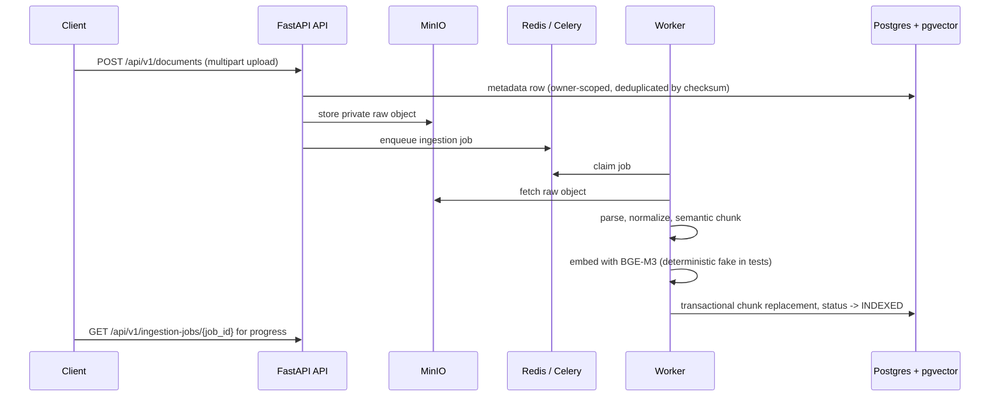

# System Overview

## Overview

`RAG_LLM_Services` is a Docker Compose modular monolith plus worker. The architecture keeps request handling, domain rules, RAG logic, provider adapters, automation, CI evidence, and observability in separate boundaries.

## System Diagram

The full component map with default ports is rendered in the [README Architecture section](../../README.md#architecture). The two load-bearing flows below show how a document becomes retrievable and how a question becomes a cited answer.

### Document ingestion flow



Failure behavior: worker retries are bounded and a final failure moves the job to `FAILED` with a terminal record. A dead worker cannot wedge the queue: stale in-flight ingestion jobs (stuck in `PARSING`/`CHUNKING`/`EMBEDDING`) are reclaimed inline the next time a worker claims from the queue via the stale-before window, and stale `RUNNING` evaluation rows are requeued by the evaluation claim path.

### Grounded chat flow

```mermaid
sequenceDiagram
  participant C as Client
  participant API as FastAPI API
  participant R as Hybrid retriever
  participant G as LLM gateway
  participant D as DeepSeek provider

  C->>API: POST /api/v1/chat or /chat/stream
  API->>R: query normalization, vector + FTS, RRF fusion, rerank
  R-->>API: source-labeled context chunks [S1..Sn]
  API->>G: prompt with untrusted-context guard and citations
  G->>D: Responses API call (live only when authorized; fake otherwise)
  D-->>G: answer text + usage
  G-->>API: response, cost recorded per conversation
  API-->>C: validated citations; semantic SSE events (no [DONE] sentinel)
```

The citation validator rejects answer content that invents sources; raw retrieved text is labeled untrusted data, never instructions.

## Runtime Paths

Main chat path:

```text
Next.js client -> FastAPI router -> application service -> RAG or agent orchestration -> retriever -> LLM gateway -> DeepSeek adapter -> cited response
```

Ingestion path:

```text
Upload request -> metadata row -> MinIO raw object -> Redis job -> worker -> parser -> normalizer -> chunker -> embedding provider -> Postgres pgvector and FTS
```

Automation path:

```text
n8n schedule or webhook -> bounded API endpoint -> job or evaluation record -> worker -> report and metrics
```

Observability path:

```text
API, worker, exporters, and n8n -> Prometheus scrape -> Grafana dashboards
```

Verification path:

```text
local phase gate -> GitHub Actions definition -> hosted CI run after push -> release evidence
```

## Boundaries

- Presentation layer owns FastAPI routers and Next.js screens.
- Application layer owns use cases and transaction boundaries.
- Domain layer owns knowledge-base, document, conversation, citation, and evaluation rules.
- AI/RAG layer owns chunking, embeddings, retrieval, reranking, prompts, and citation validation.
- Agent layer owns OpenAI Agents SDK orchestration and bounded tool calls.
- Infrastructure layer owns database, Redis, MinIO, provider clients, and Docker wiring.
- Observability layer owns logs, metrics, dashboards, and release evidence.
- Automation layer owns n8n workflows outside the synchronous chat path.
- CI/CD layer owns local workflow validation and hosted GitHub Actions definitions.

## Production Guardrails

- Public APIs use server-resolved owner scope and do not trust client-supplied `owner_id`.
- Raw documents, raw prompts, raw chunks, secrets, and auth headers are not logged.
- Provider calls go through the internal LLM gateway.
- DeepSeek defaults to `https://api.deepseek.com`, `deepseek-v4-flash`, and Responses API mode.
- Live provider tests are opt-in and use synthetic public input only.
- Production readiness uses separate local, CI, live-provider, deployed, backup/restore, and observability gates.

## Navigation

- Ingestion: [Ingestion pipeline](../rag/ingestion-pipeline.md)
- Retrieval and evaluation: [Hybrid retrieval and reranking pipeline](../rag/retrieval-pipeline.md)
- Agent and provider boundary: [Agent and LLM gateway architecture](../agent/agent-architecture.md)
- n8n: [n8n workflow contract](../n8n/workflows.md)
- Metrics and dashboards: [Metrics and observability](../observability/metrics.md)
- Containers: [Docker deployment notes](../deployment/docker.md)
- Security: [Threat model](../security/threat-model.md)
